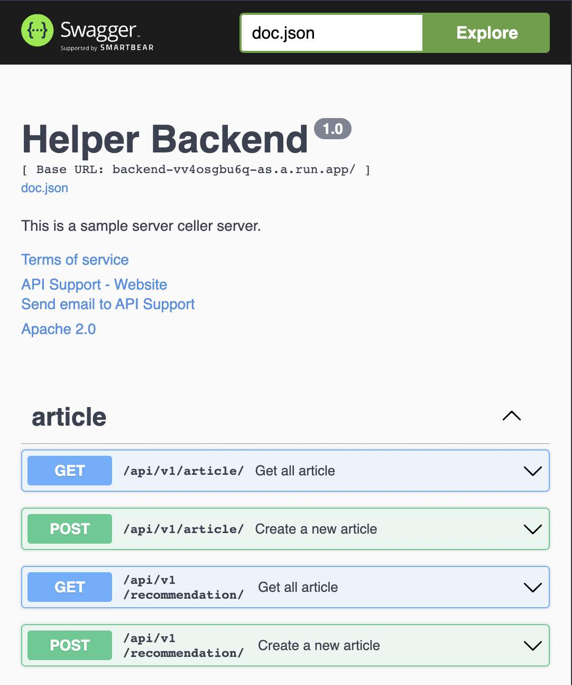

<div id="top"></div>

<br />
<div align="center">
  <a href="https://github.com/github_username/repo_name">
    
  </a>

<h3 align="center">Serantau Backend</h3>


</div>


## About the Project
### Tools That we use
1. Goland IDE (IDE for Develop applications running on Golang)
2. VsCode (Multipurpose Text Editor)
3. ERD Diagraming Tools
4. Swagger Open API 2.0 Documentation
5. Library:
+ Echo ( Golang Backend Framework)
+ Gorm ( Golang ORM to make Database CRUD acting like object instead of rows)
+ Uber/FX ( Golang Dependency Injection Library, To make Low Coupling, High Cohesion Architecture using Dependency Injection)
+ Cobra ( Golang library for creating powerful modern CLI applications )
+ Viper ( Golang library for configuration file)
6. Infrastructure:
+ Terraform
+ Cloud Run
+ Cloud Storage
+ Cloud SQL (Postgresql)
+ Container Registry

## Getting Started

### Current GCP Architect

<div align="center">
  <a href="https://github.com/github_username/repo_name">
    
  </a>

<h3 align="center">Serantau Backend</h3>


</div>


### Prerequisites

Things you need to use the software and how to install them.
* docker
  ```sh
  brew install --cask docker
  ```

### Installation

1. Clone the repo
   ```sh
   git clone https://github.com/BangkitCapstone-HELPER/backend
   ```
2. copy config/config.yaml.example to config.yaml and provide your credentials

3. Run container
   ```sh
   docker-compose up
   ```
4. Open 
    ```curl
    localhost:8080/docs/
    ```

Swagger Documentation Looks:
<div align="center">
  <a href="https://github.com/github_username/repo_name">
    
  </a>


</div>